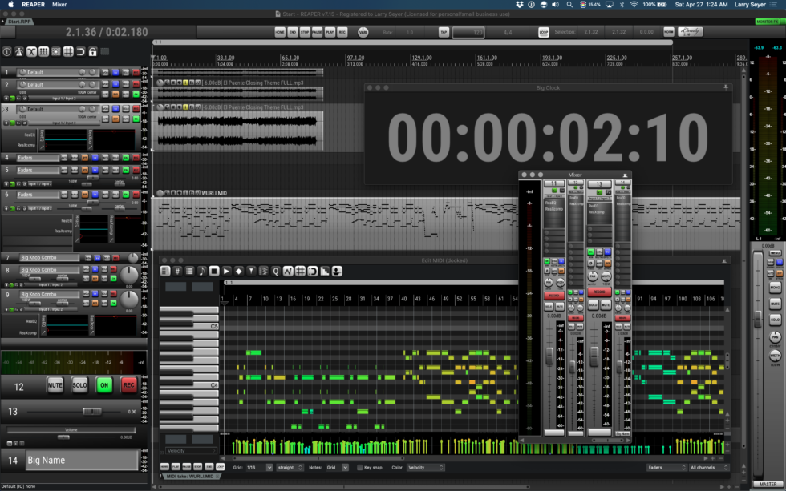
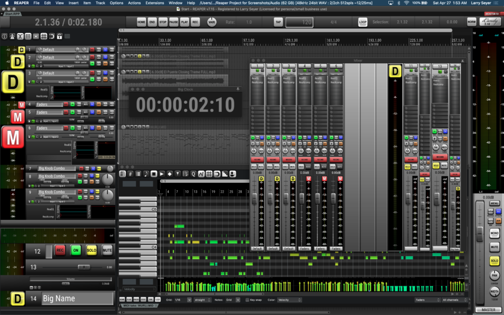

# Larry Seyer Website Redesign - Implementation Plan

> **For Claude:** REQUIRED SUB-SKILL: Use superpowers:executing-plans to implement this plan task-by-task.

**Goal:** Rebuild larryseyer.github.io with "The Architect" design - clean precision, no compromise aesthetic.

**Architecture:** Static HTML/CSS/JS site. True black background, amber accents, Space Grotesk/Inter typography. 11 pages total with dedicated project pages pulling content and graphics from GitHub repos.

**Tech Stack:** HTML5, CSS3 (CSS variables), vanilla JS, Google Fonts (Space Grotesk, Inter, JetBrains Mono)

---

## Pre-Implementation Setup

### Task 0: Clean workspace and verify structure

**Files:**
- Remove: `larryseyer.com/` (scraped WordPress content)
- Keep: `images/`, `docs/`, `CLAUDE.md`, `iCandy_2.10.zip`

**Step 1: Remove old scraped content**
```bash
rm -rf larryseyer.com/
```

**Step 2: Remove old vanilla HTML files**
```bash
rm -rf css/ js/ pages/ index.html
```

**Step 3: Create new directory structure**
```bash
mkdir -p css js pages/projects images/projects
```

**Step 4: Commit clean slate**
```bash
git add -A && git commit -m "chore: clean workspace for redesign"
```

---

## Phase 1: Foundation

### Task 1: Create new CSS foundation

**Files:**
- Create: `css/style.css`

**Step 1: Write complete stylesheet with design system**

```css
/* ==========================================================================
   Larry Seyer - The Architect Design System
   ========================================================================== */

/* Fonts */
@import url('https://fonts.googleapis.com/css2?family=Inter:wght@400;500;600&family=JetBrains+Mono:wght@400&family=Space+Grotesk:wght@500;700&display=swap');

:root {
  /* Colors */
  --color-bg: #000000;
  --color-surface: #0a0a0a;
  --color-border: #1a1a1a;
  --color-text: #ffffff;
  --color-text-secondary: #888888;
  --color-accent: #f59e0b;
  --color-accent-hover: #fbbf24;

  /* Typography */
  --font-display: 'Space Grotesk', sans-serif;
  --font-body: 'Inter', sans-serif;
  --font-mono: 'JetBrains Mono', monospace;

  /* Spacing */
  --space-xs: 0.5rem;
  --space-sm: 1rem;
  --space-md: 2rem;
  --space-lg: 4rem;
  --space-xl: 8rem;
  --space-2xl: 12rem;

  /* Layout */
  --max-width: 1200px;
  --header-height: 72px;

  /* Effects */
  --transition: 200ms ease-out;
}

/* Reset */
*, *::before, *::after {
  box-sizing: border-box;
  margin: 0;
  padding: 0;
}

html {
  font-size: 16px;
  scroll-behavior: smooth;
}

body {
  font-family: var(--font-body);
  background: var(--color-bg);
  color: var(--color-text);
  line-height: 1.6;
  -webkit-font-smoothing: antialiased;
}

/* Typography */
h1, h2, h3, h4 {
  font-family: var(--font-display);
  font-weight: 700;
  letter-spacing: -0.02em;
  line-height: 1.1;
}

h1 {
  font-size: clamp(3rem, 8vw, 5rem);
}

h2 {
  font-size: clamp(1.5rem, 4vw, 2.5rem);
  margin-bottom: var(--space-md);
}

h3 {
  font-size: 1.25rem;
  font-weight: 500;
}

p {
  color: var(--color-text-secondary);
  max-width: 65ch;
}

a {
  color: var(--color-accent);
  text-decoration: none;
  transition: color var(--transition);
}

a:hover {
  color: var(--color-accent-hover);
}

code {
  font-family: var(--font-mono);
  font-size: 0.875rem;
  background: var(--color-surface);
  padding: 0.125em 0.375em;
  border-radius: 2px;
}

/* Layout */
.container {
  max-width: var(--max-width);
  margin: 0 auto;
  padding: 0 var(--space-md);
}

.section {
  padding: var(--space-xl) 0;
}

.section + .section {
  border-top: 1px solid var(--color-border);
}

/* Header */
.header {
  position: fixed;
  top: 0;
  left: 0;
  right: 0;
  height: var(--header-height);
  background: var(--color-bg);
  border-bottom: 1px solid var(--color-border);
  z-index: 1000;
  display: flex;
  align-items: center;
}

.header .container {
  display: flex;
  justify-content: space-between;
  align-items: center;
  width: 100%;
}

.logo {
  font-family: var(--font-display);
  font-size: 1.25rem;
  font-weight: 700;
  color: var(--color-text);
  letter-spacing: -0.02em;
}

.logo:hover {
  color: var(--color-text);
}

/* Navigation */
.nav {
  display: flex;
  gap: var(--space-lg);
}

.nav a {
  color: var(--color-text-secondary);
  font-size: 0.875rem;
  font-weight: 500;
  letter-spacing: 0.05em;
  text-transform: uppercase;
  transition: color var(--transition);
}

.nav a:hover,
.nav a.active {
  color: var(--color-text);
}

.nav-toggle {
  display: none;
  background: none;
  border: none;
  color: var(--color-text);
  font-size: 1.5rem;
  cursor: pointer;
  padding: var(--space-xs);
}

/* Main */
main {
  margin-top: var(--header-height);
}

/* Hero */
.hero {
  padding: var(--space-2xl) 0 var(--space-xl);
}

.hero h1 {
  margin-bottom: var(--space-md);
}

.hero p {
  font-size: 1.25rem;
  margin-bottom: var(--space-lg);
}

/* Cards */
.card-grid {
  display: grid;
  grid-template-columns: repeat(auto-fit, minmax(280px, 1fr));
  gap: var(--space-md);
}

.card {
  background: transparent;
  border: 1px solid var(--color-border);
  padding: var(--space-md);
  transition: border-color var(--transition), transform var(--transition);
}

.card:hover {
  border-color: var(--color-accent);
  transform: scale(1.01);
}

.card h3 {
  margin-bottom: var(--space-xs);
  color: var(--color-text);
}

.card p {
  font-size: 0.875rem;
  margin: 0;
}

.card-link {
  display: block;
  color: inherit;
}

.card-link:hover {
  color: inherit;
}

/* Status Badge */
.badge {
  display: inline-block;
  font-family: var(--font-mono);
  font-size: 0.75rem;
  padding: 0.25em 0.75em;
  border: 1px solid var(--color-border);
  color: var(--color-text-secondary);
  text-transform: uppercase;
  letter-spacing: 0.05em;
  margin-bottom: var(--space-sm);
}

.badge--active {
  border-color: var(--color-accent);
  color: var(--color-accent);
}

/* Buttons */
.btn {
  display: inline-block;
  font-family: var(--font-display);
  font-size: 0.875rem;
  font-weight: 500;
  letter-spacing: 0.05em;
  text-transform: uppercase;
  padding: var(--space-sm) var(--space-md);
  background: var(--color-accent);
  color: var(--color-bg);
  border: none;
  cursor: pointer;
  transition: all var(--transition);
}

.btn:hover {
  background: var(--color-text);
  color: var(--color-bg);
}

.btn--outline {
  background: transparent;
  border: 1px solid var(--color-accent);
  color: var(--color-accent);
}

.btn--outline:hover {
  background: var(--color-accent);
  color: var(--color-bg);
}

/* Quote/Philosophy */
.quote {
  font-family: var(--font-display);
  font-size: clamp(1.25rem, 3vw, 1.75rem);
  font-weight: 500;
  color: var(--color-text);
  max-width: 50ch;
  line-height: 1.4;
}

/* Feature List */
.features {
  list-style: none;
}

.features li {
  padding: var(--space-sm) 0;
  border-bottom: 1px solid var(--color-border);
  color: var(--color-text-secondary);
}

.features li:last-child {
  border-bottom: none;
}

.features strong {
  color: var(--color-text);
}

/* Project Hero */
.project-hero {
  padding: var(--space-xl) 0;
  border-bottom: 1px solid var(--color-border);
}

.project-hero h1 {
  font-size: clamp(2rem, 5vw, 3.5rem);
}

/* Project Screenshots */
.screenshots {
  display: grid;
  grid-template-columns: repeat(auto-fit, minmax(400px, 1fr));
  gap: var(--space-md);
  margin: var(--space-lg) 0;
}

.screenshots img {
  width: 100%;
  border: 1px solid var(--color-border);
}

/* Footer */
.footer {
  border-top: 1px solid var(--color-border);
  padding: var(--space-lg) 0;
}

.footer .container {
  display: flex;
  justify-content: space-between;
  align-items: center;
}

.footer p {
  font-size: 0.875rem;
}

.social-links {
  display: flex;
  gap: var(--space-md);
}

.social-links a {
  color: var(--color-text-secondary);
  font-size: 0.875rem;
}

/* Mobile */
@media (max-width: 768px) {
  .nav {
    display: none;
    position: absolute;
    top: var(--header-height);
    left: 0;
    right: 0;
    flex-direction: column;
    background: var(--color-bg);
    padding: var(--space-md);
    border-bottom: 1px solid var(--color-border);
    gap: var(--space-sm);
  }

  .nav.active {
    display: flex;
  }

  .nav-toggle {
    display: block;
  }

  .hero {
    padding: var(--space-xl) 0 var(--space-lg);
  }

  .footer .container {
    flex-direction: column;
    gap: var(--space-md);
    text-align: center;
  }

  .screenshots {
    grid-template-columns: 1fr;
  }
}

/* Utilities */
.text-center { text-align: center; }
.mb-sm { margin-bottom: var(--space-sm); }
.mb-md { margin-bottom: var(--space-md); }
.mb-lg { margin-bottom: var(--space-lg); }
.mt-lg { margin-top: var(--space-lg); }

/* Animations */
@keyframes fadeInUp {
  from {
    opacity: 0;
    transform: translateY(20px);
  }
  to {
    opacity: 1;
    transform: translateY(0);
  }
}

.animate-in {
  animation: fadeInUp 0.6s ease-out forwards;
}
```

**Step 2: Commit CSS foundation**
```bash
git add css/style.css && git commit -m "feat: add Architect design system CSS"
```

---

### Task 2: Create JavaScript

**Files:**
- Create: `js/main.js`

**Step 1: Write navigation and animation JS**

```javascript
// Larry Seyer - Main JavaScript

document.addEventListener('DOMContentLoaded', () => {
  // Mobile navigation
  const navToggle = document.querySelector('.nav-toggle');
  const nav = document.querySelector('.nav');

  if (navToggle && nav) {
    navToggle.addEventListener('click', () => {
      nav.classList.toggle('active');
    });

    document.addEventListener('click', (e) => {
      if (!nav.contains(e.target) && !navToggle.contains(e.target)) {
        nav.classList.remove('active');
      }
    });
  }

  // Scroll animations
  const animateOnScroll = () => {
    const elements = document.querySelectorAll('.section');
    elements.forEach(el => {
      const rect = el.getBoundingClientRect();
      if (rect.top < window.innerHeight * 0.8) {
        el.classList.add('animate-in');
      }
    });
  };

  window.addEventListener('scroll', animateOnScroll);
  animateOnScroll();
});
```

**Step 2: Commit JS**
```bash
git add js/main.js && git commit -m "feat: add navigation and scroll animations"
```

---

## Phase 2: Core Pages

### Task 3: Create homepage

**Files:**
- Create: `index.html`

**Step 1: Write homepage HTML**

```html
<!DOCTYPE html>
<html lang="en">
<head>
  <meta charset="UTF-8">
  <meta name="viewport" content="width=device-width, initial-scale=1.0">
  <title>Larry Seyer</title>
  <meta name="description" content="Nine-time Grammy Award-winning engineer. Building the future of audio with AI.">
  <link rel="stylesheet" href="css/style.css">
</head>
<body>
  <header class="header">
    <div class="container">
      <a href="/" class="logo">Larry Seyer</a>
      <button class="nav-toggle" aria-label="Menu">☰</button>
      <nav class="nav">
        <a href="/" class="active">Home</a>
        <a href="pages/work.html">Work</a>
        <a href="pages/projects/">Projects</a>
        <a href="pages/live.html">Live</a>
        <a href="pages/connect.html">Connect</a>
      </nav>
    </div>
  </header>

  <main>
    <section class="hero">
      <div class="container">
        <h1>Larry Seyer</h1>
        <p>Nine-time Grammy Award-winning engineer.<br>Building the future of audio with AI.</p>
        <a href="pages/projects/" class="btn">View Projects</a>
      </div>
    </section>

    <section class="section">
      <div class="container">
        <h2>Capabilities</h2>
        <div class="card-grid">
          <div class="card">
            <h3>Audio Engineering</h3>
            <p>Decades of studio experience. Natural sound. Performance-first approach.</p>
          </div>
          <div class="card">
            <h3>Software Development</h3>
            <p>Cross-platform audio applications. JUCE, C++, real-time DSP.</p>
          </div>
          <div class="card">
            <h3>AI & Audio</h3>
            <p>Humanized rhythm systems. Algorithmic composition. Machine learning for music.</p>
          </div>
          <div class="card">
            <h3>Live Production</h3>
            <p>Broadcast automation. Streaming solutions. Remote studio consulting.</p>
          </div>
        </div>
      </div>
    </section>

    <section class="section">
      <div class="container">
        <p class="quote">"I don't settle for 'good enough.' Every project gets the solution it deserves—not the solution that's convenient."</p>
      </div>
    </section>

    <section class="section">
      <div class="container">
        <h2>Current Focus</h2>
        <div class="card-grid">
          <a href="pages/projects/otto.html" class="card-link">
            <div class="card">
              <span class="badge badge--active">Active Development</span>
              <h3>OTTO</h3>
              <p>Organic Tempo and Time Orchestrator. AI-driven drum machine with human-realistic timing.</p>
            </div>
          </a>
          <a href="pages/projects/jtf-news.html" class="card-link">
            <div class="card">
              <span class="badge badge--active">Live</span>
              <h3>JTF News</h3>
              <p>24/7 automated news. Only verifiable facts. No opinions. No adjectives.</p>
            </div>
          </a>
          <a href="pages/projects/grim.html" class="card-link">
            <div class="card">
              <span class="badge badge--active">Active Development</span>
              <h3>GRIM</h3>
              <p>Scene-based loop station for REAPER with integrated OTTO drummer.</p>
            </div>
          </a>
        </div>
      </div>
    </section>
  </main>

  <footer class="footer">
    <div class="container">
      <p>&copy; 2026 Larry Seyer</p>
      <div class="social-links">
        <a href="https://github.com/larryseyer" target="_blank">GitHub</a>
        <a href="https://youtube.com/larryseyer" target="_blank">YouTube</a>
      </div>
    </div>
  </footer>

  <script src="js/main.js"></script>
</body>
</html>
```

**Step 2: Commit homepage**
```bash
git add index.html && git commit -m "feat: add homepage with Architect design"
```

---

### Task 4: Create Work page

**Files:**
- Create: `pages/work.html`

**Step 1: Write work page** (credentials without name-dropping)

```html
<!DOCTYPE html>
<html lang="en">
<head>
  <meta charset="UTF-8">
  <meta name="viewport" content="width=device-width, initial-scale=1.0">
  <title>Work | Larry Seyer</title>
  <link rel="stylesheet" href="../css/style.css">
</head>
<body>
  <header class="header">
    <div class="container">
      <a href="/" class="logo">Larry Seyer</a>
      <button class="nav-toggle" aria-label="Menu">☰</button>
      <nav class="nav">
        <a href="/">Home</a>
        <a href="work.html" class="active">Work</a>
        <a href="projects/">Projects</a>
        <a href="live.html">Live</a>
        <a href="connect.html">Connect</a>
      </nav>
    </div>
  </header>

  <main>
    <section class="hero">
      <div class="container">
        <h1>The Work</h1>
        <p>Four decades of audio engineering, production, and innovation.</p>
      </div>
    </section>

    <section class="section">
      <div class="container">
        <h2>By the Numbers</h2>
        <div class="card-grid">
          <div class="card">
            <h3>9</h3>
            <p>Grammy Awards</p>
          </div>
          <div class="card">
            <h3>8</h3>
            <p>Film Scores</p>
          </div>
          <div class="card">
            <h3>40+</h3>
            <p>Years in Audio</p>
          </div>
        </div>
      </div>
    </section>

    <section class="section">
      <div class="container">
        <h2>Film & Television</h2>
        <ul class="features">
          <li><strong>Sound Mixer</strong> — Before Sunrise, Dazed and Confused, The Return of the Texas Chainsaw Massacre</li>
          <li><strong>Original Score</strong> — Dream House, French Quarter Undercover</li>
          <li><strong>Music</strong> — National TV shows and documentaries</li>
        </ul>
      </div>
    </section>

    <section class="section">
      <div class="container">
        <h2>Sample Libraries</h2>
        <p class="mb-md">Professional sample libraries used by composers worldwide.</p>
        <ul class="features">
          <li><strong>Larry Seyer Acoustic Drums</strong> — Industry-standard drum samples</li>
          <li><strong>Larry Seyer Acoustic Bass</strong> — Authentic bass recordings</li>
          <li><strong>GigaPiano</strong> — Original recordings for Nemesys Music</li>
        </ul>
      </div>
    </section>

    <section class="section">
      <div class="container">
        <h2>Author</h2>
        <p>"There is Only One of Us Here – And it's not you!" — A lighthearted approach to remembering who you really are.</p>
      </div>
    </section>
  </main>

  <footer class="footer">
    <div class="container">
      <p>&copy; 2026 Larry Seyer</p>
      <div class="social-links">
        <a href="https://github.com/larryseyer" target="_blank">GitHub</a>
        <a href="https://youtube.com/larryseyer" target="_blank">YouTube</a>
      </div>
    </div>
  </footer>

  <script src="../js/main.js"></script>
</body>
</html>
```

**Step 2: Commit work page**
```bash
git add pages/work.html && git commit -m "feat: add work page with credentials"
```

---

### Task 5: Create Projects hub page

**Files:**
- Create: `pages/projects/index.html`

**Step 1: Write projects index**

```html
<!DOCTYPE html>
<html lang="en">
<head>
  <meta charset="UTF-8">
  <meta name="viewport" content="width=device-width, initial-scale=1.0">
  <title>Projects | Larry Seyer</title>
  <link rel="stylesheet" href="../../css/style.css">
</head>
<body>
  <header class="header">
    <div class="container">
      <a href="/" class="logo">Larry Seyer</a>
      <button class="nav-toggle" aria-label="Menu">☰</button>
      <nav class="nav">
        <a href="/">Home</a>
        <a href="../work.html">Work</a>
        <a href="./" class="active">Projects</a>
        <a href="../live.html">Live</a>
        <a href="../connect.html">Connect</a>
      </nav>
    </div>
  </header>

  <main>
    <section class="hero">
      <div class="container">
        <h1>Projects</h1>
        <p>Audio software, automation tools, and experiments.</p>
      </div>
    </section>

    <section class="section">
      <div class="container">
        <h2>Featured</h2>
        <div class="card-grid">
          <a href="otto.html" class="card-link">
            <div class="card">
              <span class="badge badge--active">Active Development</span>
              <h3>OTTO</h3>
              <p>Organic Tempo and Time Orchestrator. A drummer plugin that thinks like a musician.</p>
            </div>
          </a>
          <a href="jtf-news.html" class="card-link">
            <div class="card">
              <span class="badge badge--active">Live</span>
              <h3>JTF News</h3>
              <p>24/7 automated news stream. Only verifiable facts.</p>
            </div>
          </a>
          <a href="grim.html" class="card-link">
            <div class="card">
              <span class="badge badge--active">Active Development</span>
              <h3>GRIM</h3>
              <p>Scene-based loop station for REAPER with integrated OTTO drummer.</p>
            </div>
          </a>
        </div>
      </div>
    </section>

    <section class="section">
      <div class="container">
        <h2>Tools & Utilities</h2>
        <div class="card-grid">
          <a href="icandy.html" class="card-link">
            <div class="card">
              <span class="badge">Released</span>
              <h3>iCandy</h3>
              <p>Premium theme for REAPER DAW.</p>
            </div>
          </a>
          <a href="showswitcher.html" class="card-link">
            <div class="card">
              <span class="badge">Released</span>
              <h3>ShowSwitcher</h3>
              <p>Automatic camera and overlay switching for Companion.</p>
            </div>
          </a>
          <a href="midi2button.html" class="card-link">
            <div class="card">
              <span class="badge">Released</span>
              <h3>MIDI2Button</h3>
              <p>MIDI to Button trigger for Companion.</p>
            </div>
          </a>
        </div>
      </div>
    </section>
  </main>

  <footer class="footer">
    <div class="container">
      <p>&copy; 2026 Larry Seyer</p>
      <div class="social-links">
        <a href="https://github.com/larryseyer" target="_blank">GitHub</a>
        <a href="https://youtube.com/larryseyer" target="_blank">YouTube</a>
      </div>
    </div>
  </footer>

  <script src="../../js/main.js"></script>
</body>
</html>
```

**Step 2: Commit projects hub**
```bash
git add pages/projects/index.html && git commit -m "feat: add projects hub page"
```

---

### Task 6: Create OTTO project page

**Files:**
- Create: `pages/projects/otto.html`
- Download: Screenshot from GitHub repo

**Step 1: Write OTTO page**

```html
<!DOCTYPE html>
<html lang="en">
<head>
  <meta charset="UTF-8">
  <meta name="viewport" content="width=device-width, initial-scale=1.0">
  <title>OTTO | Larry Seyer</title>
  <link rel="stylesheet" href="../../css/style.css">
</head>
<body>
  <header class="header">
    <div class="container">
      <a href="/" class="logo">Larry Seyer</a>
      <button class="nav-toggle" aria-label="Menu">☰</button>
      <nav class="nav">
        <a href="/">Home</a>
        <a href="../work.html">Work</a>
        <a href="./" class="active">Projects</a>
        <a href="../live.html">Live</a>
        <a href="../connect.html">Connect</a>
      </nav>
    </div>
  </header>

  <main>
    <section class="project-hero">
      <div class="container">
        <span class="badge badge--active">Active Development</span>
        <h1>OTTO</h1>
        <p>Organic Tempo and Time Orchestrator — A drummer plugin that thinks like a musician.</p>
      </div>
    </section>

    <section class="section">
      <div class="container">
        <h2>The Problem</h2>
        <p>Drum machines sound mechanical. Real drummers are expensive and not always available. OTTO bridges the gap with AI-driven rhythm generation that captures human feel.</p>
      </div>
    </section>

    <section class="section">
      <div class="container">
        <h2>Key Features</h2>
        <ul class="features">
          <li><strong>8 Independent Rhythm Players</strong> — Each with its own patterns, running in different time signatures simultaneously</li>
          <li><strong>200 Included Patterns</strong> — Multiple styles including odd time signatures</li>
          <li><strong>Dual Audio Engine</strong> — TR-808 style synthesis AND high-quality SFZ sample player</li>
          <li><strong>Algorithmic Fills</strong> — 12 fill archetypes with 7 energy curves, generated on-the-fly</li>
          <li><strong>4-Level Velocity</strong> — Ghost, Soft, Normal, Accented with global scaling</li>
          <li><strong>MIDI Output</strong> — Drive external drum players on any channel</li>
        </ul>
      </div>
    </section>

    <section class="section">
      <div class="container">
        <h2>Platforms</h2>
        <ul class="features">
          <li><strong>macOS</strong> — AU, VST3, AAX, Standalone (10.15+)</li>
          <li><strong>Windows</strong> — VST3, AAX, Standalone (Windows 10+)</li>
          <li><strong>Linux</strong> — VST3, Standalone (Ubuntu 20.04+)</li>
          <li><strong>iOS</strong> — AUv3 (iOS 14+)</li>
        </ul>
      </div>
    </section>

    <section class="section">
      <div class="container">
        <a href="https://github.com/larryseyer/OTTO" target="_blank" class="btn">View on GitHub</a>
      </div>
    </section>
  </main>

  <footer class="footer">
    <div class="container">
      <p>&copy; 2026 Larry Seyer</p>
      <div class="social-links">
        <a href="https://github.com/larryseyer" target="_blank">GitHub</a>
        <a href="https://youtube.com/larryseyer" target="_blank">YouTube</a>
      </div>
    </div>
  </footer>

  <script src="../../js/main.js"></script>
</body>
</html>
```

**Step 2: Commit OTTO page**
```bash
git add pages/projects/otto.html && git commit -m "feat: add OTTO project page"
```

---

### Task 7: Create JTF News project page

**Files:**
- Create: `pages/projects/jtf-news.html`

**Step 1: Write JTF News page**

```html
<!DOCTYPE html>
<html lang="en">
<head>
  <meta charset="UTF-8">
  <meta name="viewport" content="width=device-width, initial-scale=1.0">
  <title>JTF News | Larry Seyer</title>
  <link rel="stylesheet" href="../../css/style.css">
</head>
<body>
  <header class="header">
    <div class="container">
      <a href="/" class="logo">Larry Seyer</a>
      <button class="nav-toggle" aria-label="Menu">☰</button>
      <nav class="nav">
        <a href="/">Home</a>
        <a href="../work.html">Work</a>
        <a href="./" class="active">Projects</a>
        <a href="../live.html">Live</a>
        <a href="../connect.html">Connect</a>
      </nav>
    </div>
  </header>

  <main>
    <section class="project-hero">
      <div class="container">
        <span class="badge badge--active">Live 24/7</span>
        <h1>JTF News</h1>
        <p>Just The Facts. No opinions. No adjectives. No interpretation.</p>
      </div>
    </section>

    <section class="section">
      <div class="container">
        <h2>The Problem</h2>
        <p>News is polluted with opinion, spin, and emotional manipulation. JTF News delivers only verified facts confirmed by 2+ independent sources.</p>
      </div>
    </section>

    <section class="section">
      <div class="container">
        <h2>Principles</h2>
        <ul class="features">
          <li><strong>No opinions</strong> — Facts only, verifiable and sourced</li>
          <li><strong>No adjectives</strong> — No emotional coloring</li>
          <li><strong>No speculation</strong> — If it's not confirmed, it doesn't air</li>
          <li><strong>No unnamed sources</strong> — Full transparency</li>
          <li><strong>2+ source verification</strong> — Every fact independently confirmed</li>
        </ul>
      </div>
    </section>

    <section class="section">
      <div class="container">
        <h2>Watch & Subscribe</h2>
        <ul class="features">
          <li><strong>YouTube</strong> — youtube.com/@JTFNewsLive (24/7 Live)</li>
          <li><strong>RSS Feed</strong> — Add to any RSS reader</li>
          <li><strong>Alexa Flash Briefing</strong> — "Alexa, what's my Flash Briefing?"</li>
          <li><strong>Screen Saver</strong> — Turn JTF News into your desktop screen saver</li>
        </ul>
      </div>
    </section>

    <section class="section">
      <div class="container">
        <a href="https://www.youtube.com/@JTFNewsLive" target="_blank" class="btn">Watch Live</a>
        <a href="https://github.com/larryseyer/jtfnews" target="_blank" class="btn btn--outline">GitHub</a>
      </div>
    </section>
  </main>

  <footer class="footer">
    <div class="container">
      <p>&copy; 2026 Larry Seyer</p>
      <div class="social-links">
        <a href="https://github.com/larryseyer" target="_blank">GitHub</a>
        <a href="https://youtube.com/larryseyer" target="_blank">YouTube</a>
      </div>
    </div>
  </footer>

  <script src="../../js/main.js"></script>
</body>
</html>
```

**Step 2: Commit JTF News page**
```bash
git add pages/projects/jtf-news.html && git commit -m "feat: add JTF News project page"
```

---

### Task 8: Create GRIM project page

**Files:**
- Create: `pages/projects/grim.html`
- Download: `Splash_Screen.png` and `Main_GUI.png` from repo

**Step 1: Download GRIM screenshots**
```bash
curl -L "https://raw.githubusercontent.com/larryseyer/GRIM-for-Reaper/main/Splash_Screen.png" -o images/projects/grim-splash.png
curl -L "https://raw.githubusercontent.com/larryseyer/GRIM-for-Reaper/main/Main_GUI.png" -o images/projects/grim-main.png
```

**Step 2: Write GRIM page with screenshots**

```html
<!DOCTYPE html>
<html lang="en">
<head>
  <meta charset="UTF-8">
  <meta name="viewport" content="width=device-width, initial-scale=1.0">
  <title>GRIM | Larry Seyer</title>
  <link rel="stylesheet" href="../../css/style.css">
</head>
<body>
  <header class="header">
    <div class="container">
      <a href="/" class="logo">Larry Seyer</a>
      <button class="nav-toggle" aria-label="Menu">☰</button>
      <nav class="nav">
        <a href="/">Home</a>
        <a href="../work.html">Work</a>
        <a href="./" class="active">Projects</a>
        <a href="../live.html">Live</a>
        <a href="../connect.html">Connect</a>
      </nav>
    </div>
  </header>

  <main>
    <section class="project-hero">
      <div class="container">
        <span class="badge badge--active">Active Development</span>
        <h1>GRIM</h1>
        <p>Groove, Rhythm & Iteration Machine — Scene-based loop station for REAPER with integrated OTTO drummer.</p>
      </div>
    </section>

    <section class="section">
      <div class="container">
        <div class="screenshots">
          
        </div>
      </div>
    </section>

    <section class="section">
      <div class="container">
        <h2>The Problem</h2>
        <p>Live looping requires real-time control while performing. GRIM provides scene-based architecture that handles complexity so you can focus on the music.</p>
      </div>
    </section>

    <section class="section">
      <div class="container">
        <h2>Key Features</h2>
        <ul class="features">
          <li><strong>20 Scenes</strong> — 4x5 grid, each controlling up to 64 tracks</li>
          <li><strong>Dynamic Length</strong> — First recording defines scene length (1-64 measures)</li>
          <li><strong>OTTO Integration</strong> — Built-in AI drummer that follows your performance</li>
          <li><strong>REAPER Native</strong> — JSFX plugins + Lua scripts, no external dependencies</li>
          <li><strong>Sample-Accurate</strong> — Real-time audio/MIDI processing</li>
        </ul>
      </div>
    </section>

    <section class="section">
      <div class="container">
        <a href="https://github.com/larryseyer/GRIM-for-Reaper" target="_blank" class="btn">View on GitHub</a>
      </div>
    </section>
  </main>

  <footer class="footer">
    <div class="container">
      <p>&copy; 2026 Larry Seyer</p>
      <div class="social-links">
        <a href="https://github.com/larryseyer" target="_blank">GitHub</a>
        <a href="https://youtube.com/larryseyer" target="_blank">YouTube</a>
      </div>
    </div>
  </footer>

  <script src="../../js/main.js"></script>
</body>
</html>
```

**Step 3: Commit GRIM page and images**
```bash
git add pages/projects/grim.html images/projects/ && git commit -m "feat: add GRIM project page with screenshots"
```

---

### Task 9: Create iCandy project page

**Files:**
- Create: `pages/projects/icandy.html`

**Step 1: Write iCandy page**

```html
<!DOCTYPE html>
<html lang="en">
<head>
  <meta charset="UTF-8">
  <meta name="viewport" content="width=device-width, initial-scale=1.0">
  <title>iCandy | Larry Seyer</title>
  <link rel="stylesheet" href="../../css/style.css">
</head>
<body>
  <header class="header">
    <div class="container">
      <a href="/" class="logo">Larry Seyer</a>
      <button class="nav-toggle" aria-label="Menu">☰</button>
      <nav class="nav">
        <a href="/">Home</a>
        <a href="../work.html">Work</a>
        <a href="./" class="active">Projects</a>
        <a href="../live.html">Live</a>
        <a href="../connect.html">Connect</a>
      </nav>
    </div>
  </header>

  <main>
    <section class="project-hero">
      <div class="container">
        <span class="badge">Released</span>
        <h1>iCandy</h1>
        <p>Premium theme for REAPER DAW. Skeuomorphic design that inspires creativity.</p>
      </div>
    </section>

    <section class="section">
      <div class="container">
        <div class="screenshots">
          
          
        </div>
      </div>
    </section>

    <section class="section">
      <div class="container">
        <h2>Features</h2>
        <ul class="features">
          <li><strong>Fully Customizable</strong> — Adapt the interface to your workflow</li>
          <li><strong>Resolution Support</strong> — 720P through 8K displays</li>
          <li><strong>Performance Optimized</strong> — Fast loading after initial graphics cache</li>
          <li><strong>Free Forever</strong> — Tips appreciated, but never required</li>
        </ul>
      </div>
    </section>

    <section class="section">
      <div class="container">
        <a href="../../iCandy_2.10.zip" class="btn" download>Download v2.10</a>
        <a href="https://github.com/larryseyer/iCandy" target="_blank" class="btn btn--outline">GitHub</a>
      </div>
    </section>
  </main>

  <footer class="footer">
    <div class="container">
      <p>&copy; 2026 Larry Seyer</p>
      <div class="social-links">
        <a href="https://github.com/larryseyer" target="_blank">GitHub</a>
        <a href="https://youtube.com/larryseyer" target="_blank">YouTube</a>
      </div>
    </div>
  </footer>

  <script src="../../js/main.js"></script>
</body>
</html>
```

**Step 2: Commit iCandy page**
```bash
git add pages/projects/icandy.html && git commit -m "feat: add iCandy project page"
```

---

### Task 10: Create ShowSwitcher project page

**Files:**
- Create: `pages/projects/showswitcher.html`

**Step 1: Write ShowSwitcher page**

```html
<!DOCTYPE html>
<html lang="en">
<head>
  <meta charset="UTF-8">
  <meta name="viewport" content="width=device-width, initial-scale=1.0">
  <title>ShowSwitcher | Larry Seyer</title>
  <link rel="stylesheet" href="../../css/style.css">
</head>
<body>
  <header class="header">
    <div class="container">
      <a href="/" class="logo">Larry Seyer</a>
      <button class="nav-toggle" aria-label="Menu">☰</button>
      <nav class="nav">
        <a href="/">Home</a>
        <a href="../work.html">Work</a>
        <a href="./" class="active">Projects</a>
        <a href="../live.html">Live</a>
        <a href="../connect.html">Connect</a>
      </nav>
    </div>
  </header>

  <main>
    <section class="project-hero">
      <div class="container">
        <span class="badge">Released</span>
        <h1>ShowSwitcher</h1>
        <p>Automatic camera and overlay switching for BitFocus Companion.</p>
      </div>
    </section>

    <section class="section">
      <div class="container">
        <h2>The Problem</h2>
        <p>Solo performers can't manage production while performing. ShowSwitcher automatically cycles through cameras and overlays with randomized timing—making streams look professionally produced.</p>
      </div>
    </section>

    <section class="section">
      <div class="container">
        <h2>Key Features</h2>
        <ul class="features">
          <li><strong>Dual Switchers</strong> — Separate control for cameras and overlays</li>
          <li><strong>Random Timing</strong> — Natural-looking switching within configured ranges</li>
          <li><strong>Pause/Resume</strong> — Control without losing state</li>
          <li><strong>Sequential Mode</strong> — Ordered cycling alternative</li>
          <li><strong>MIDI Control</strong> — Extended CC mappings</li>
          <li><strong>Performance Monitoring</strong> — Track HTTP success rates and response times</li>
        </ul>
      </div>
    </section>

    <section class="section">
      <div class="container">
        <h2>Use Cases</h2>
        <ul class="features">
          <li><strong>Live Performance</strong> — Hands-free camera switching while playing</li>
          <li><strong>Escape Rooms</strong> — Automated scene changes</li>
          <li><strong>24/7 Streams</strong> — Unattended dynamic content</li>
          <li><strong>Multi-Platform</strong> — Control OBS, vMix, ATEM simultaneously</li>
        </ul>
      </div>
    </section>

    <section class="section">
      <div class="container">
        <a href="https://github.com/larryseyer/companion-module-generic-showswitcher" target="_blank" class="btn">View on GitHub</a>
      </div>
    </section>
  </main>

  <footer class="footer">
    <div class="container">
      <p>&copy; 2026 Larry Seyer</p>
      <div class="social-links">
        <a href="https://github.com/larryseyer" target="_blank">GitHub</a>
        <a href="https://youtube.com/larryseyer" target="_blank">YouTube</a>
      </div>
    </div>
  </footer>

  <script src="../../js/main.js"></script>
</body>
</html>
```

**Step 2: Commit ShowSwitcher page**
```bash
git add pages/projects/showswitcher.html && git commit -m "feat: add ShowSwitcher project page"
```

---

### Task 11: Create MIDI2Button project page

**Files:**
- Create: `pages/projects/midi2button.html`

**Step 1: Write MIDI2Button page**

```html
<!DOCTYPE html>
<html lang="en">
<head>
  <meta charset="UTF-8">
  <meta name="viewport" content="width=device-width, initial-scale=1.0">
  <title>MIDI2Button | Larry Seyer</title>
  <link rel="stylesheet" href="../../css/style.css">
</head>
<body>
  <header class="header">
    <div class="container">
      <a href="/" class="logo">Larry Seyer</a>
      <button class="nav-toggle" aria-label="Menu">☰</button>
      <nav class="nav">
        <a href="/">Home</a>
        <a href="../work.html">Work</a>
        <a href="./" class="active">Projects</a>
        <a href="../live.html">Live</a>
        <a href="../connect.html">Connect</a>
      </nav>
    </div>
  </header>

  <main>
    <section class="project-hero">
      <div class="container">
        <span class="badge">Released</span>
        <h1>MIDI2Button</h1>
        <p>MIDI to Button trigger for BitFocus Companion.</p>
      </div>
    </section>

    <section class="section">
      <div class="container">
        <h2>The Problem</h2>
        <p>MIDI controllers can't directly trigger Companion buttons. MIDI2Button bridges your hardware to your streaming software.</p>
      </div>
    </section>

    <section class="section">
      <div class="container">
        <h2>Key Features</h2>
        <ul class="features">
          <li><strong>Any MIDI Device</strong> — Keyboards, drum pads, foot controllers</li>
          <li><strong>Up to 24 Rules</strong> — Map any MIDI note to any Companion button</li>
          <li><strong>Bank/Program Support</strong> — 16,384 banks × 128 programs</li>
          <li><strong>Visual Feedback</strong> — Buttons light up on trigger</li>
          <li><strong>Simple Setup</strong> — Connect, map, done</li>
        </ul>
      </div>
    </section>

    <section class="section">
      <div class="container">
        <a href="https://github.com/larryseyer/midi2button" target="_blank" class="btn">View on GitHub</a>
      </div>
    </section>
  </main>

  <footer class="footer">
    <div class="container">
      <p>&copy; 2026 Larry Seyer</p>
      <div class="social-links">
        <a href="https://github.com/larryseyer" target="_blank">GitHub</a>
        <a href="https://youtube.com/larryseyer" target="_blank">YouTube</a>
      </div>
    </div>
  </footer>

  <script src="../../js/main.js"></script>
</body>
</html>
```

**Step 2: Commit MIDI2Button page**
```bash
git add pages/projects/midi2button.html && git commit -m "feat: add MIDI2Button project page"
```

---

### Task 12: Create Live page

**Files:**
- Create: `pages/live.html`

**Step 1: Write Live page**

```html
<!DOCTYPE html>
<html lang="en">
<head>
  <meta charset="UTF-8">
  <meta name="viewport" content="width=device-width, initial-scale=1.0">
  <title>Live | Larry Seyer</title>
  <link rel="stylesheet" href="../css/style.css">
</head>
<body>
  <header class="header">
    <div class="container">
      <a href="/" class="logo">Larry Seyer</a>
      <button class="nav-toggle" aria-label="Menu">☰</button>
      <nav class="nav">
        <a href="/">Home</a>
        <a href="work.html">Work</a>
        <a href="projects/">Projects</a>
        <a href="live.html" class="active">Live</a>
        <a href="connect.html">Connect</a>
      </nav>
    </div>
  </header>

  <main>
    <section class="hero">
      <div class="container">
        <h1>The Larry Seyer Show</h1>
        <p>Live music, humor, and interaction.<br>Every Thursday at 7:00 PM Central.</p>
      </div>
    </section>

    <section class="section">
      <div class="container">
        <p class="quote">"Just like on your phone – 'There's an App for That'… on The Larry Seyer Show – 'There's a Song for That!'"</p>
      </div>
    </section>

    <section class="section">
      <div class="container">
        <h2>Watch Live</h2>
        <div class="card-grid">
          <a href="https://www.youtube.com/larryseyer" target="_blank" class="card-link">
            <div class="card">
              <h3>YouTube</h3>
              <p>youtube.com/larryseyer</p>
            </div>
          </a>
          <a href="https://www.facebook.com/larryseyer" target="_blank" class="card-link">
            <div class="card">
              <h3>Facebook</h3>
              <p>facebook.com/larryseyer</p>
            </div>
          </a>
          <a href="https://www.twitch.tv/larryseyer" target="_blank" class="card-link">
            <div class="card">
              <h3>Twitch</h3>
              <p>twitch.tv/larryseyer</p>
            </div>
          </a>
          <a href="https://rumble.com/c/larryseyer" target="_blank" class="card-link">
            <div class="card">
              <h3>Rumble</h3>
              <p>rumble.com/c/larryseyer</p>
            </div>
          </a>
        </div>
      </div>
    </section>
  </main>

  <footer class="footer">
    <div class="container">
      <p>&copy; 2026 Larry Seyer</p>
      <div class="social-links">
        <a href="https://github.com/larryseyer" target="_blank">GitHub</a>
        <a href="https://youtube.com/larryseyer" target="_blank">YouTube</a>
      </div>
    </div>
  </footer>

  <script src="../js/main.js"></script>
</body>
</html>
```

**Step 2: Commit Live page**
```bash
git add pages/live.html && git commit -m "feat: add Live show page"
```

---

### Task 13: Create Connect page

**Files:**
- Create: `pages/connect.html`

**Step 1: Write Connect page**

```html
<!DOCTYPE html>
<html lang="en">
<head>
  <meta charset="UTF-8">
  <meta name="viewport" content="width=device-width, initial-scale=1.0">
  <title>Connect | Larry Seyer</title>
  <link rel="stylesheet" href="../css/style.css">
</head>
<body>
  <header class="header">
    <div class="container">
      <a href="/" class="logo">Larry Seyer</a>
      <button class="nav-toggle" aria-label="Menu">☰</button>
      <nav class="nav">
        <a href="/">Home</a>
        <a href="work.html">Work</a>
        <a href="projects/">Projects</a>
        <a href="live.html">Live</a>
        <a href="connect.html" class="active">Connect</a>
      </nav>
    </div>
  </header>

  <main>
    <section class="hero">
      <div class="container">
        <h1>Connect</h1>
        <p>Collaboration. Consulting. Conversation.</p>
      </div>
    </section>

    <section class="section">
      <div class="container">
        <div class="card-grid">
          <a href="https://github.com/larryseyer" target="_blank" class="card-link">
            <div class="card">
              <h3>GitHub</h3>
              <p>Code and projects</p>
            </div>
          </a>
          <a href="https://www.youtube.com/larryseyer" target="_blank" class="card-link">
            <div class="card">
              <h3>YouTube</h3>
              <p>Videos and live streams</p>
            </div>
          </a>
          <a href="https://www.facebook.com/larryseyer" target="_blank" class="card-link">
            <div class="card">
              <h3>Facebook</h3>
              <p>Updates and community</p>
            </div>
          </a>
          <a href="https://www.twitch.tv/larryseyer" target="_blank" class="card-link">
            <div class="card">
              <h3>Twitch</h3>
              <p>Live streaming</p>
            </div>
          </a>
        </div>
      </div>
    </section>

    <section class="section">
      <div class="container">
        <p>Best way to connect: join The Larry Seyer Show live, Thursdays at 7PM Central.</p>
      </div>
    </section>
  </main>

  <footer class="footer">
    <div class="container">
      <p>&copy; 2026 Larry Seyer</p>
      <div class="social-links">
        <a href="https://github.com/larryseyer" target="_blank">GitHub</a>
        <a href="https://youtube.com/larryseyer" target="_blank">YouTube</a>
      </div>
    </div>
  </footer>

  <script src="../js/main.js"></script>
</body>
</html>
```

**Step 2: Commit Connect page**
```bash
git add pages/connect.html && git commit -m "feat: add Connect page"
```

---

### Task 14: Download project images from GitHub

**Files:**
- Download: JTF News logo from repo
- Download: Any additional screenshots

**Step 1: Download JTF News logo**
```bash
curl -L "https://raw.githubusercontent.com/larryseyer/jtfnews/main/logos/logo-horizontal-dark.svg" -o images/projects/jtf-news-logo.svg
```

**Step 2: Commit images**
```bash
git add images/projects/ && git commit -m "feat: add project images from GitHub repos"
```

---

### Task 15: Final cleanup and update CLAUDE.md

**Files:**
- Modify: `CLAUDE.md`

**Step 1: Update CLAUDE.md with final structure**

**Step 2: Final commit**
```bash
git add -A && git commit -m "chore: finalize site redesign implementation"
```

---

## Summary

**Total Tasks:** 15
**Total Pages:** 11 (index + 2 main + 7 project + 1 hub)
**Commits:** ~15 atomic commits

**Execution estimate:** The plan is ready for implementation.
